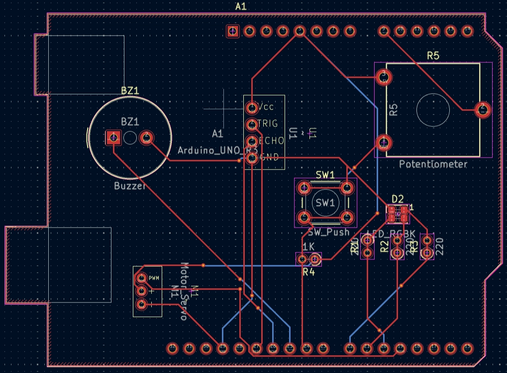
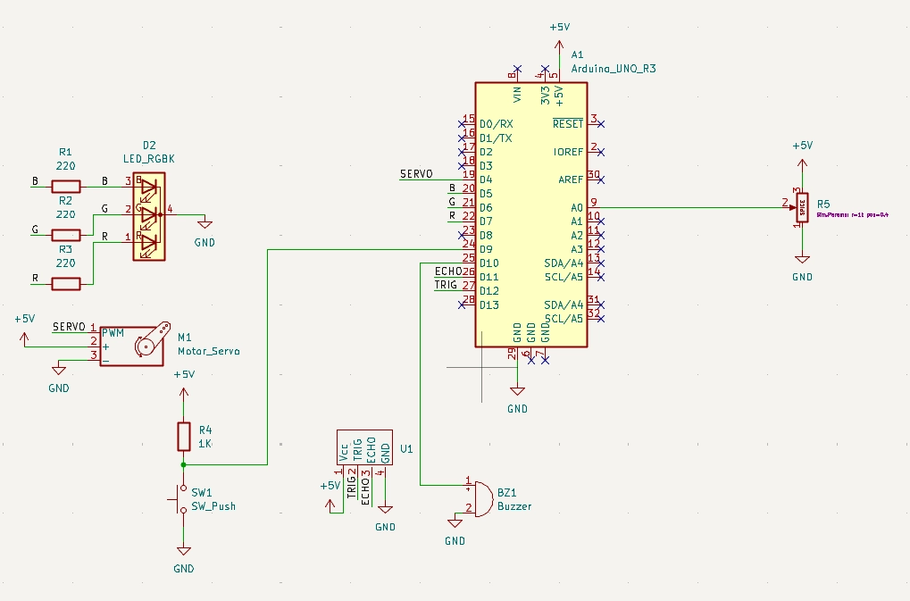
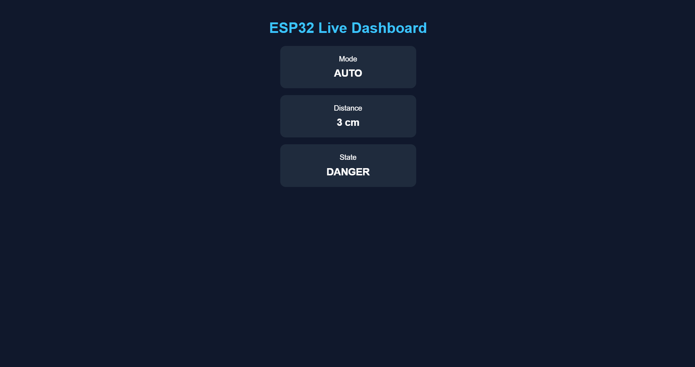
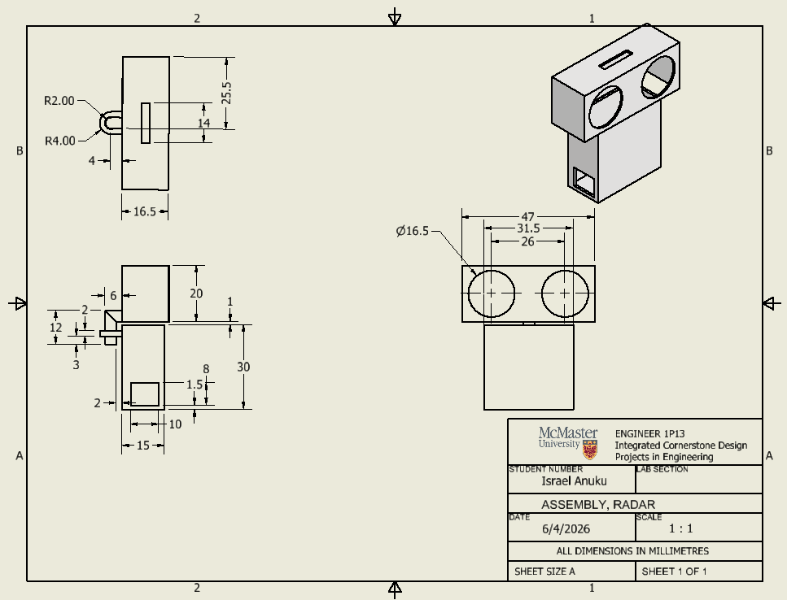

# ESP32-Arduino-Proximity-Monitoring

An embedded proximity monitoring system built using an Arduino Uno and ESP32. The system combines ultrasonic distance sensing, servo-based scanning, RGB LED and buzzer alerts, manual/automatic operating modes, UART communication, and a Wi-Fi web dashboard for live system monitoring.

## Project Overview

The system continuously monitors the distance of nearby objects using an ultrasonic sensor mounted on a servo motor.

The Arduino Uno is responsible for the primary sensing and control functions, while the ESP32 receives system data through UART and provides a wireless web dashboard.

### System Architecture

```text
Ultrasonic Sensor
       │
       ▼
Arduino Uno
       │
       ├── Servo Control
       ├── RGB LED Status
       ├── Buzzer Alerts
       ├── Mode Selection
       └── Distance Processing
       │
       │ UART
       ▼
     ESP32
       │
       │ Wi-Fi
       ▼
 Web Dashboard
```

Features
Ultrasonic distance measurement using an HC-SR04 sensor
Servo-based automatic scanning
Manual servo positioning using a potentiometer
AUTO and MANUAL operating modes
SAFE, WARNING, and DANGER system states
RGB LED status indication
Audible buzzer alert
Non-blocking servo control using millis()
Invalid ultrasonic reading handling
UART communication between Arduino and ESP32
ESP32 Wi-Fi web server
Live browser dashboard with automatic data updates
Custom PCB design using KiCad
3D enclosure design and engineering drawing

------------------------------------------------------------------------------------
| Component                 | Purpose                                              |
| ------------------------- | ---------------------------------------------------- |
| Arduino Uno               | Main system controller                               |
| ESP32                     | Wireless communication and web dashboard             |
| HC-SR04 Ultrasonic Sensor | Distance measurement                                 |
| SG90 Servo Motor          | Sensor positioning and scanning                      |
| RGB LED                   | System state indication                              |
| Buzzer                    | Audible warning                                      |
| Push Button               | AUTO/MANUAL mode selection                           |
| Potentiometer             | Manual servo control and warning-distance adjustment |
| Custom PCB                | Hardware integration                                 |
------------------------------------------------------------------------------------

Operating Modes
AUTO Mode

The servo continuously sweeps between approximately 0° and 180° while the ultrasonic sensor measures the distance of nearby objects.

The system determines its state based on configured distance thresholds.

MANUAL Mode

The potentiometer controls the servo position, allowing the user to manually aim the ultrasonic sensor.

The potentiometer also adjusts the warning-distance threshold within a defined range.
---------------------------------------------------------------------------------------------------------------------------------------

System States

| State   | Condition                    | Indicator        |
| ------- | ---------------------------- | ---------------- |
| SAFE    | Object outside warning range | Green LED        |
| WARNING | Object within warning range  | Blue LED         |
| DANGER  | Object within danger range   | Red LED + buzzer |

The default thresholds are:

Warning distance: 25 cm
Danger distance: 10 cm

The warning threshold can be adjusted in MANUAL mode.
---------------------------------------------------------------------------------------------------------------------------------------

Firmware

Arduino

The Arduino firmware is written in embedded C++ and handles:

Ultrasonic sensor triggering and distance measurement
Distance validation and filtering
Servo control
AUTO/MANUAL mode switching
System state management
RGB LED control
Buzzer control
Serial data transmission

Servo movement uses millis()-based timing instead of blocking delays, allowing other system functions to continue running while the servo is being controlled.

ESP32
-----

The ESP32 firmware is responsible for:

Receiving system data from the Arduino over UART
Parsing mode, distance, and state information
Connecting to a Wi-Fi network
Hosting the web dashboard
Providing a JSON /data endpoint
Updating dashboard information automatically

The Arduino communicates with the ESP32 using UART at **115200** baud.

Communication Architecture

The Arduino transmits formatted system data such as:

**[MODE]: AUTO | DIST: 23 | STATE: WARNING**

The ESP32 parses this information and makes it available through a JSON endpoint.

The dashboard periodically requests the endpoint and updates the displayed values without requiring a page refresh.

Arduino
   │
   │ UART @ 115200 baud
   ▼
ESP32
   │
   │ Wi-Fi
   ▼
Web Browser

PCB Design

A custom PCB was designed in KiCad to integrate the Arduino-based sensing and control hardware.


The PCB includes connections for:

Ultrasonic sensor
Servo motor
RGB LED
Buzzer
Push button
Potentiometer
Arduino Uno
PCB Layout

PCB 3D Render

**Electrical Schematic**:

The system schematic was designed in KiCad to define the connections between the Arduino and peripheral components.



**Web Dashboard**:

The ESP32 hosts a web dashboard displaying:
-Current operating mode
-Measured distance
-Current system state

The dashboard automatically polls the ESP32 for updated data, allowing system information to change without manually refreshing the webpage.


Enclosure Design:

A 3D enclosure was designed to house and integrate the electronic components.

An engineering drawing was created to define the enclosure dimensions and geometry.



**Software & Tools**:
Programming
C++
HTML
CSS
JavaScript

**Hardware & Embedded**:
Arduino Uno
ESP32
HC-SR04
SG90 Servo
GPIO
PWM
UART
ADC

**Engineering Software**
Arduino IDE
KiCad
Autodesk Inventor
